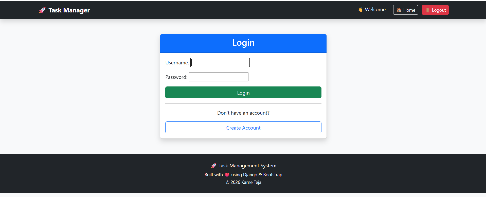
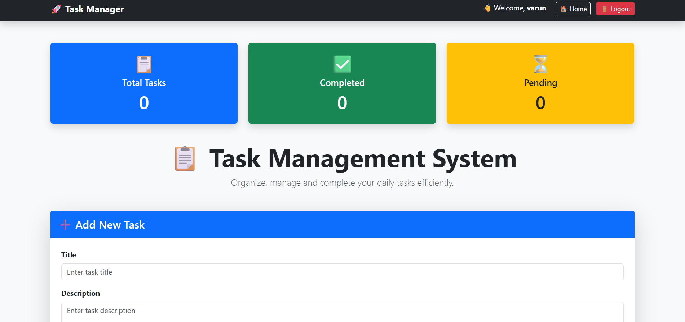
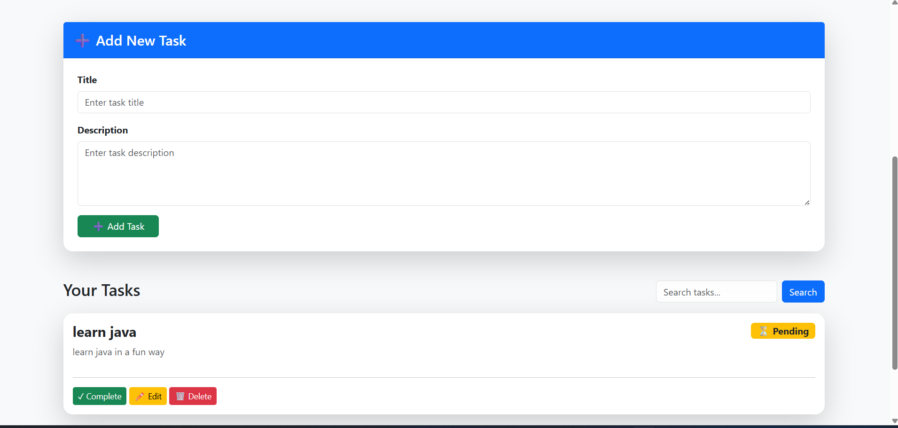
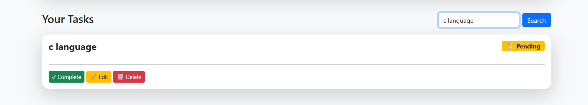

#  Task Management System

A modern **Task Management Web Application** built with **Django** and **Bootstrap 5**.

This application allows users to securely manage their daily tasks through an intuitive dashboard with authentication, search functionality, and task tracking.

---

##  Live Demo

**Render Deployment**

https://task-management-system-kweo.onrender.com

---

##  Features

-  User Registration
-  Secure Login & Logout
-  Create Tasks
-  Edit Tasks
-  Delete Tasks
-  Mark Tasks Complete
-  Pending Tasks
-  Search Tasks
-  Dashboard Statistics
-  Success Messages
-  Responsive Design
-  Bootstrap UI

---

#  Screenshots

##  Login Page

Secure user authentication with login and registration.



---

##  Dashboard

Track your productivity with task statistics.

- Total Tasks
- Completed Tasks
- Pending Tasks



---

##  Add New Task

Create and organize tasks using a clean, responsive interface.



---

##  Search Tasks

Instantly search tasks by title for quick access.



#  Built With

- Python
- Django
- Bootstrap 5
- HTML5
- CSS3
- SQLite
- Git
- GitHub
- Render

---

#  Project Structure

```
Task-Management-System/
│
 accounts/
 config/
 tasks/
 staticfiles/
 manage.py
 requirements.txt
 runtime.txt
 build.sh
 README.md
 db.sqlite3
```

---

#  Installation

Clone the repository

```bash
git clone https://github.com/nikilthecode/task-management-system.git
```

Go to project folder

```bash
cd task-management-system
```

Create virtual environment

```bash
python -m venv .venv
```

Activate

Windows

```bash
.venv\Scripts\activate
```

Install dependencies

```bash
pip install -r requirements.txt
```

Apply migrations

```bash
python manage.py migrate
```

Run server

```bash
python manage.py runserver
```

Visit

```
http://127.0.0.1:8000
```

---

#  Deployment

This project is deployed on **Render** using

- Gunicorn
- WhiteNoise
- Environment Variables
- SQLite Database

Live URL

https://task-management-system-kweo.onrender.com

---

#  Future Improvements

-  Due Dates
-  Task Priority
-  Categories
-  Email Notifications
-  File Uploads
-  Dark Mode
-  Charts
-  REST API

---

#  Author

## Karne Teja

MCA Student

Skills

- Python
- Django
- HTML
- CSS
- JavaScript
- Bootstrap
- Git
- GitHub

GitHub

https://github.com/nikilthecode

---

##  Support

If you found this project useful,Star this repository.
